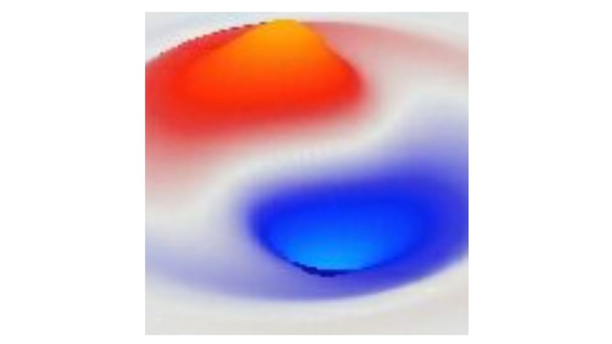

<h1 align="center">
    
</h1>

Waves is a wave simulator for quantum physics wave equations, with an interactive 3D GUI interface that shows you the waves rippling across your screen. It is integrated into the [Wave Reality](https://wavereality.org) wiki-like interactive documentation of quantum physics, from the perspective where the quantum waves are physically real (i.e., the pilot-wave approach of de Broglie & Bohm). See that link for full documentation of all the physics that goes into this simulator.

Waves supports every relevant type of quantum wave, from the basic second-order "physical" wave, to Maxwell's equations for electromagnetic fields (based on the A four-potential), to Schrodinger, Klein-Gordon, Dirac, Weyl, and finally, the full electroweak (EW) system of coupled wave equations that simulates the Higgs boson interacting with four copies of a Maxwell-like four-potential, to generate the massless EM field along with the massive W and Z boson fields of the weak force. This EW system couples with Weyl fermions (electrons and neutrinos), and demonstrates the full symmetry breaking phenomena, to show where mass comes from in the Standard Model.

Everything is written in Go, using the [Cogent Core](https://cogentcore.org) GUI framework, including the [Cogent Lab](https://cogentcore.org/lab) math and plotting framework. Specifically Lab provides the [GoSL](https://cogentcore.org/lab/gosl) framework that converts the Go code into WebGPU shaders, allowing the wave equations to be run on the GPU, both within a web browser and on your own local app. This provides very high-speed updates for large-sized 3D spaces.

In technical terms, the waves are simulated using lattice-based explicit forward Euler integration, with appropriate Visscher and Boris steps where relevant for numerical stability. The Laplacian and Gradient are computed using 19-point and 10-point kernels that I had previously designed and analyzed (O’Reilly, R.C. & Beck, J.M. (2006). A Family of Large-Stencil Discrete Laplacian Approximations in Three Dimensions. [PDF](https://randalloreilly.com/papers/OReillyBeck06.pdf). Edges can be Fixed, Wrapped, or Damped (e.g., Sommerfield damping). Everything is backed by extensive tests that validate all aspects of the code. 

## Use of AI

Claude (Opus 5.5) was used after the initial app was written entirely by the main human author (Randall O'Reilly) (starting on 20 Sept, 2026), and everything was carefully reviewed and guided by me. The summary transcript of all the prompts and output from Claude is available in: xxx. Given my lack of knowledge about many technical details, Claude was invaluable for writing all the appropriate tests, and for implementing the electroweak sector especially. I had previously hand-written all the basic wave equations up to the Dirac, in an earlier version of this simulator written in C++.

## News

* Oct, 2026: Version 1.0 released.

